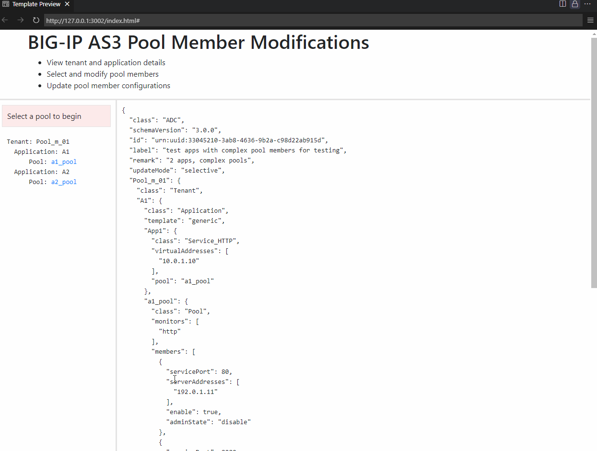

# as3_pool_mbmr_mgmt

exploring the modification of as3 pool members and status for AS3 workflows

- clone the repo
- install an html preview extension
  - I've been using ms-vscode.live-server
- preview the index.html
  - select a pool
  - make changes
  - click "Update AS3"
  - review changes in AS3 at bottom
  - njoy!

## Demo

